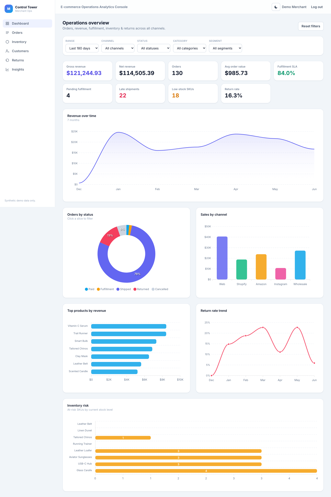
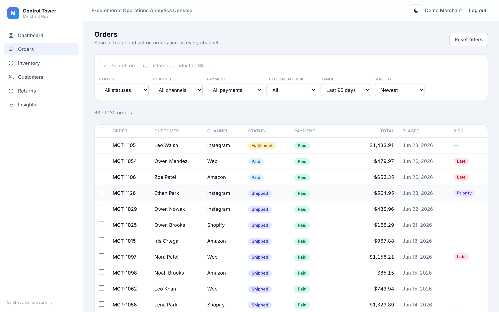
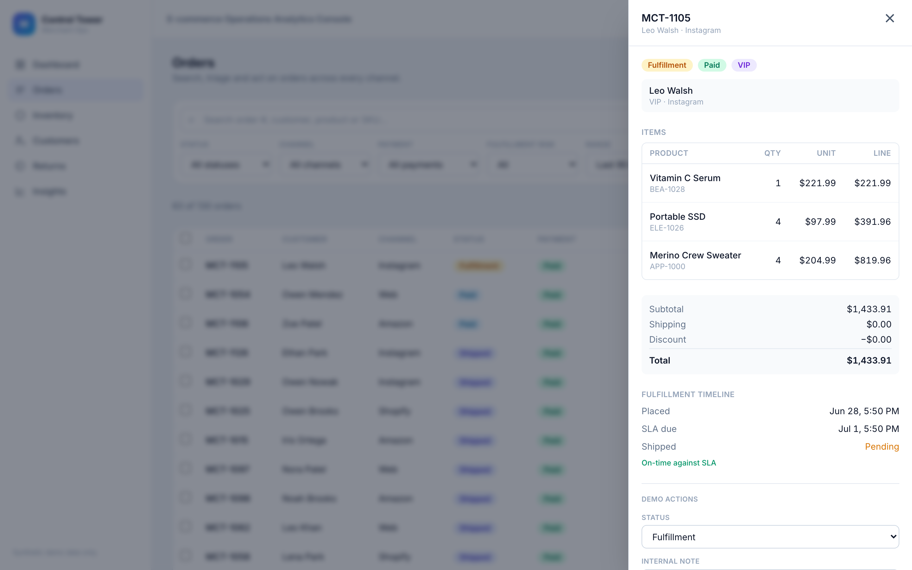
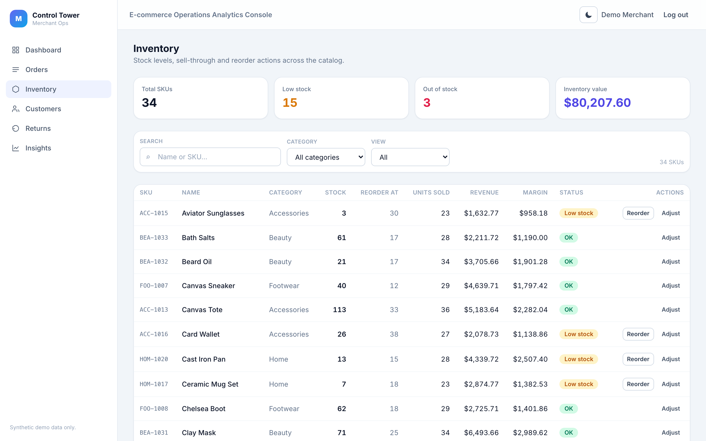
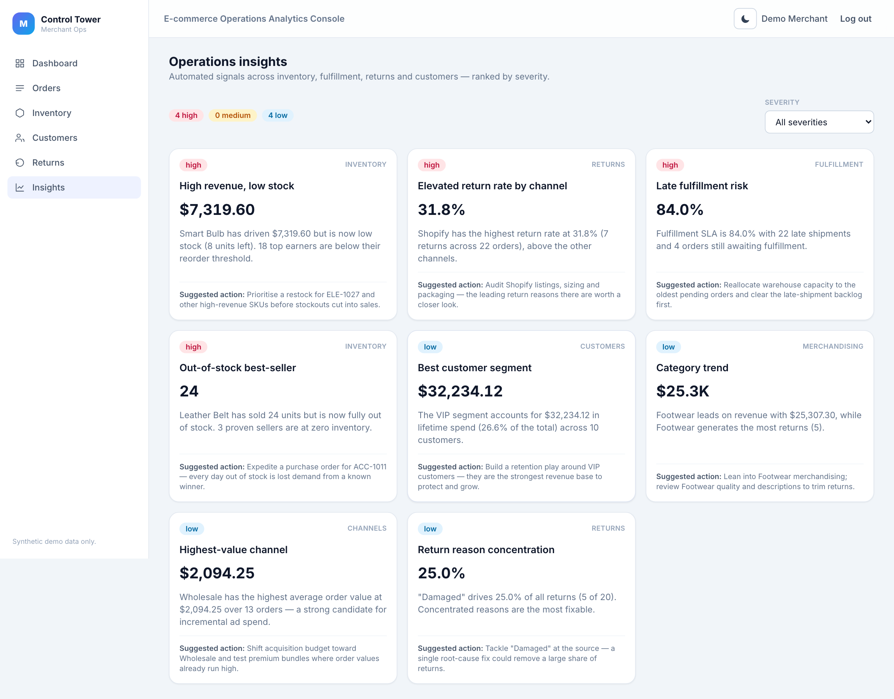
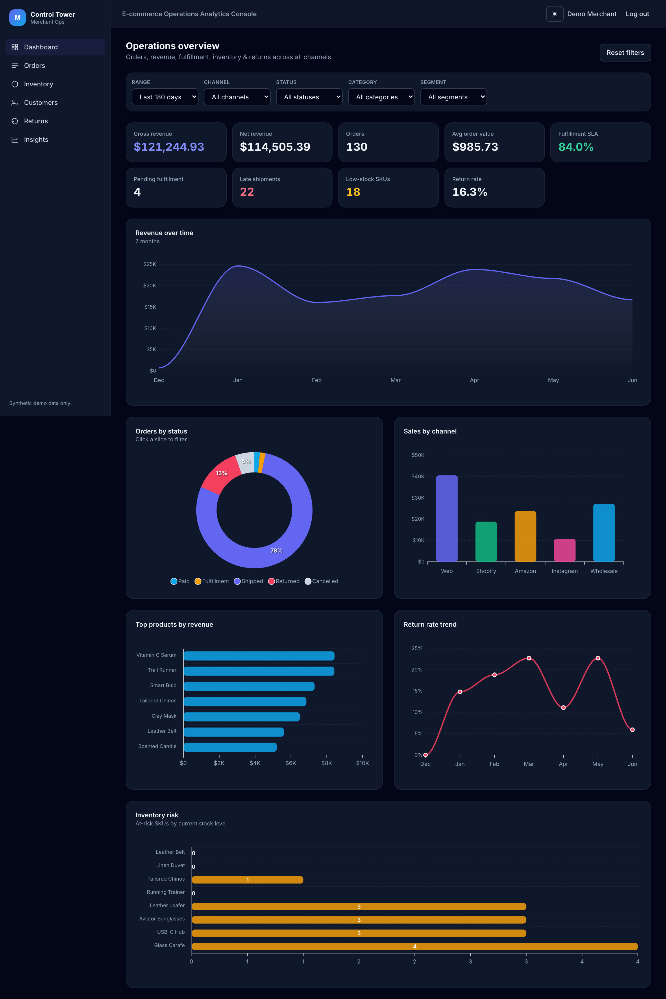
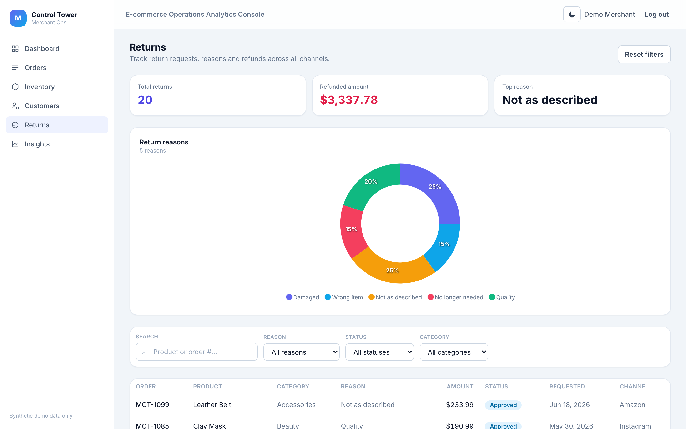
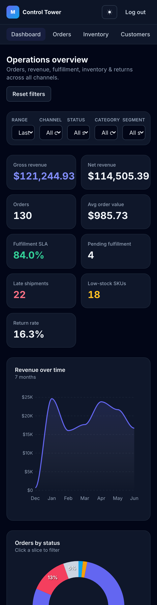
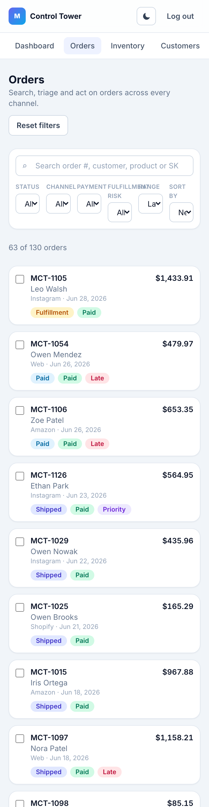

# Merchant Control Tower

**E-commerce Operations Analytics Console — orders, inventory, revenue, fulfillment & returns.**

A premium, full-stack merchant/admin command center built with Nuxt 3. It is a dense
but clean SaaS operations dashboard — KPI cards, interactive charts, cross-filtering,
drill-down modals and drawers, searchable/sortable data tables, bulk actions, and a
light/dark, fully responsive UI — backed by a Nitro API and a seeded SQLite database.

> Portfolio demo with **synthetic data only** — no real customer data, no external links.

**Demo account:** `demo@example.com` / `demo12345`

## What it demonstrates

- A real **operations command center** (not a storefront, not basic CRUD): analytics,
  filters, drill-downs, drawers, modals, dense tables, bulk actions, status timelines.
- **Full-stack** in one repo: Nuxt server routes (Nitro) + Prisma/SQLite + a typed Pinia
  store that does live, client-side cross-filtering of KPIs and charts.
- Strong **frontend/dashboard** chops: reusable component kit, ApexCharts, theme-aware
  charts, restrained motion, responsive layout with no horizontal overflow.



<table>
  <tr>
    <td width="50%"></td>
    <td width="50%"></td>
  </tr>
  <tr>
    <td width="50%"></td>
    <td width="50%"></td>
  </tr>
  <tr>
    <td width="50%"></td>
    <td width="50%"></td>
  </tr>
</table>

<p align="center">
  
  &nbsp;
  
</p>

## Stack

- **Nuxt 3** + **Vue 3** + **TypeScript**
- **Tailwind CSS** (class-based dark mode)
- **Pinia** (typed store, live cross-filtering)
- **Nitro** server routes (auth + data API)
- **Prisma** + **SQLite** (seeded, deterministic demo data)
- **ApexCharts** (`vue3-apexcharts`)

## Features

- **Dashboard** — 9 KPIs (gross/net revenue, orders, AOV, fulfillment SLA, pending
  fulfillment, late shipments, low-stock SKUs, return rate); revenue-over-time, orders
  by status, sales by channel, top products, return-rate trend, and inventory-risk
  charts; date/channel/status/category/segment filters that update everything live;
  click a KPI or chart slice to drill down.
- **Orders** — desktop table / mobile cards, search, status/channel/payment/risk filters,
  sorting, bulk selection with a demo bulk-action bar, and an order detail **drawer**
  (items, totals, status timeline, payment, notes, returns) with demo actions
  (change status, add note, mark priority).
- **Inventory** — stock levels, reorder thresholds, units sold, revenue, margin, stock
  status; filters (low/out of stock, category, best sellers); **stock adjustment** and
  **reorder recommendation** modals.
- **Customers** — segments, spend, orders, return rate; detail modal with order history,
  preferred channel, top products, and risk/opportunity labels.
- **Returns** — return queue with reason/status/category filters, a return-reasons chart,
  and a return detail modal.
- **Insights** — computed operational insights (high-revenue/low-stock, channel return
  trends, fulfillment risk, best segment, category trends) with severity, metric,
  explanation, and a suggested action; click for detail.

## Setup

```bash
npm install            # also runs: nuxt prepare + prisma generate
npm run db:push        # create the SQLite schema
npm run seed           # load deterministic demo data
npm run dev            # http://localhost:3000
```

Sign in with `demo@example.com` / `demo12345`.

## Deployment notes (future live demo)

- The app is a single full-stack Nuxt project. `npm run build` produces a Node server in
  `.output/`; run it with `node .output/server/index.mjs`.
- Set `DATABASE_URL` (SQLite `file:` path or a hosted Postgres URL after switching the
  Prisma `datasource` provider). For SQLite hosting, ship a pre-seeded `dev.db` or run
  `prisma db push` + `npm run seed` on first boot.
- Works on Node-friendly hosts (Render, Railway, Fly.io, a small VPS). No paid APIs.

## Screenshots

All screenshots live in [`docs/screenshots/`](docs/screenshots) and are kept ≤ 4000×4000 px
(Upwork's upload limit). Verify with:

```bash
node docs/check-screenshots.mjs
```

---

Synthetic demo data only. This project exists to demonstrate front-end and full-stack
engineering for e-commerce operations tooling.
